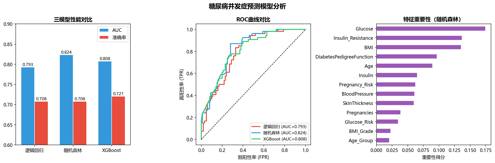

# 糖尿病并发症预测

基于768条患者临床数据，通过特征工程构造5个衍生特征，
使用SMOTE处理类别不均衡，对比三个模型，随机森林AUC达0.824。

---

## 项目概况

| 项目 | 详情 |
|------|------|
| 数据集 | Pima Indians Diabetes Dataset（768条） |
| 技术栈 | Python / pandas / sklearn / XGBoost / imbalanced-learn |
| 原始特征数 | 8个 |
| 工程后特征数 | 13个（新增5个衍生特征） |
| 最优模型 | 随机森林 AUC=0.824 |

---

## 核心亮点

### 特征工程（项目难点）
原始数据中Glucose、BMI、Insulin等字段存在以0代替缺失值的问题，
用中位数填充后，构造以下5个衍生特征：

| 衍生特征 | 构造方法 | 医学含义 |
|----------|----------|----------|
| BMI_Grade | BMI分4级 | 体重状态分级 |
| Glucose_Risk | 血糖分3级 | 糖尿病风险等级 |
| Age_Group | 年龄分4组 | 年龄风险分层 |
| Insulin_Resistance | 血糖×胰岛素 | 胰岛素抵抗程度 |
| Pregnancy_Risk | 妊娠次数×年龄 | 高龄多次妊娠风险 |

### 类别不均衡处理
- 原始患病率34.9%，使用SMOTE过采样平衡至50%
- 训练集从614条扩充至800条

---

## 模型对比结果

| 模型 | 准确率 | AUC |
|------|--------|-----|
| 逻辑回归 | 70.8% | 0.793 |
| XGBoost | 72.1% | 0.808 |
| **随机森林** | **70.8%** | **0.824** |

---

## 核心发现

- 血糖（Glucose）是最强预测因子，重要性得分最高
- 自构造的胰岛素抵抗指数重要性排第二，验证了特征工程的有效性
- BMI和遗传因素（DiabetesPedigreeFunction）也是重要预测指标
- SMOTE过采样有效提升了模型对患病样本的识别能力

---

## 可视化结果



---

## 局限性与改进方向

- 样本量较小（768条），可引入更大规模数据集验证
- 可尝试网格搜索调参进一步提升AUC
- 可加入SHAP值做更细致的特征解释
- 可尝试LightGBM与随机森林进一步对比

---

## 运行方式

```bash
pip install pandas numpy matplotlib seaborn scikit-learn xgboost imbalanced-learn

jupyter notebook diabetes_prediction.ipynb
```

---

## 作者

智能医学工程专业 | 数据分析方向
技术栈：Python · pandas · sklearn · XGBoost · NLTK · Power BI · SQL
